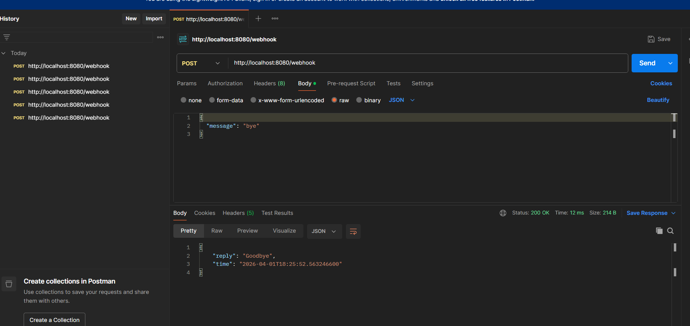
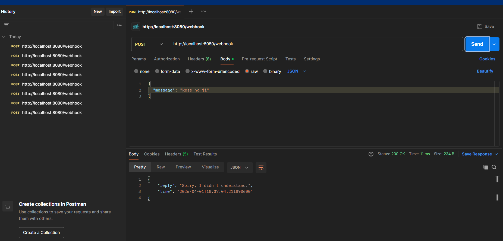
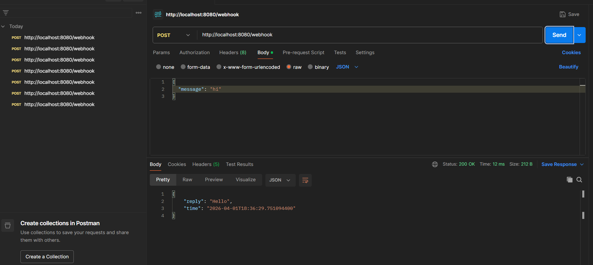

## Features
- REST API (/webhook)
- Accepts JSON input
- Returns predefined replies
- Logs messages

## API

POST /webhook

Request:
{
  "message": "Hi"
}

Response:
{
  "reply": "Hello",
  "time": "timestamp"
}

## Screenshots

### API Test

### Console Logs

### Dashboard

## Run
mvn spring-boot:run
